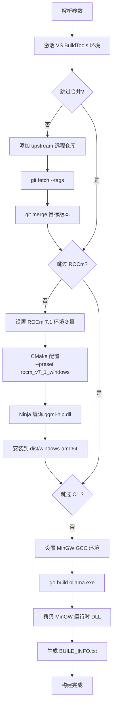



# [Windows 平台 Ollama AMD GPU 一键编译指南：基于 ROCm 7.1 的自动化实战](https://blog.csdn.net/haolove527/article/details/161979745?spm=1011.2415.3001.5331)

## 引言：从手动编译到一条命令

去年我们在 Windows 上编译 Ollama 的 AMD GPU 版本时，需要在 PowerShell 里小心翼翼地把环境变量逐个敲进去，手动搞定 CMake 和 Ninja，稍有不慎就可能因为一个架构参数而前功尽弃。如今，随着 ROCm 7.1 正式支持 RDNA 3.5 架构，社区也打磨出了一套高度自动化的构建脚本——**只需一行命令，就能把 Ollama 源码编译成原生调用 AMD GPU 的 Windows 可执行文件**。

本文将承接[《Windows 平台 Ollama AMD GPU 编译全攻略：基于 ROCm 6.2》](https://blog.csdn.net/haolove527/article/details/159876819?spm=1011.2415.3001.5331)的核心内容，聚焦于**ROCm 7.1 + 自动化脚本**的新方案。我们会从环境准备、硬件兼容、脚本使用到底层编译原理一路讲透，让你不但能跑通流程，还能理解每一步在干什么，出了问题也能快速定位。

> **适用版本**：Ollama v0.20.6 + ROCm 7.1 + Windows 10/11  
> **一键脚本仓库**：[tengfei527/ollama-for-amd-auto-build](https://github.com/tengfei527/ollama-for-amd-auto-build)

---
@[TOC]
## 一、 为什么选择 ROCm 7.1？

| 特性 | ROCm 6.2 | ROCm 7.1 |
|------|----------|----------|
| **新架构支持** | 无 RDNA 3.5 / 4 | 增加 gfx1150 系列（RX 7600 XT 等） |
| **Windows 构建稳定性** | 需要手动规避 `__builtin_verbose_trap` 等兼容问题 | 与 VS BuildTools 配合更顺畅 |
| **CMake 预设** | `ROCm 6` | `rocm_v7_1_windows`（开箱即用） |
| **HIP 编译器优化** | 基本支持 | 并行编译效率更高，内存占用更低 |

如果你用的是 **RX 7600（非 XT）、RX 7700S** 等 RDNA 3.5 显卡，ROCm 6.2 会直接报“invalid target ID”错误，必须升级到 7.1。即便是老一代的 RX 7900 XTX 等 RDNA 3 卡，新版在编译速度和运行稳定性上也有肉眼可见的改善。

---

## 二、 环境准备与硬件兼容性

### 2.1 你的 AMD 显卡能被支持吗？

编译前务必先确认 GPU 架构。下表整理了 ROCm 7.1 官方支持的主流架构及对应显卡：

| 架构代号 | GPU 系列 | 典型显卡型号 | ROCm 7.1 支持 |
| :--- | :--- | :--- | :--- |
| **gfx1100** | RDNA 3 | RX 7900 XTX / XT | ✅ |
| **gfx1102** | RDNA 3 | RX 7800 XT / 7700 XT | ✅ |
| **gfx1030** | RDNA 2 | RX 6900 XT / 6800 XT | ✅ |
| **gfx1032** | RDNA 2 | RX 6600 XT | ✅ |
| **gfx1010** | RDNA 1 | RX 5700 XT | ✅ |
| **gfx906** | GCN (Vega) | Radeon VII | ✅ |
| **gfx1152** | RDNA 3.5 | RX 7600 XT | ✅ (新增) |
| **gfx1151** | RDNA 3.5 | RX 7700S / 7600M XT | ✅ (实验性) |
| **gfx1200** | RDNA 4 | 尚未上市 | ❌ |


*图1：GPU 架构判断流程*

> **快速定位架构**：打开设备管理器 → 显示适配器 → 右键属性 → 详细信息 → 硬件 ID，根据 `VEN_1002&DEV_xxxx` 到 [TechPowerUp GPU Database](https://www.techpowerup.com/gpu-specs/) 查询对应的 GFX 代号。

### 2.2 软件依赖一览

自动化脚本会帮你处理大部分环境问题，但这些基础软件仍需提前安装：

| 软件 | 最低版本 | 作用 | 推荐安装方式 |
| :--- | :--- | :--- | :--- |
| **Visual Studio 2022 BuildTools** | 最新 | 提供 MSVC 编译器与 Ninja | `winget install Microsoft.VisualStudio.2022.BuildTools` |
| **CMake** | 4.0+ | 生成构建系统 | `winget install Kitware.CMake` |
| **Go** | 1.24+ | 编译 Ollama 主程序 | `winget install GoLang.Go` |
| **AMD ROCm** | 7.1 | HIP 运行时与编译器 | [AMD 官网下载](https://rocm.docs.amd.com/) |
| **MSYS2 (MinGW-w64)** | 最新 | GCC 工具链，供 CGO 使用 | `winget install MSYS2.MSYS2` |

**安装后快速验证：**

```powershell
cmake --version   # 应显示 4.x
go version        # 应显示 go1.24+
# 检查 ROCm
& "C:\Program Files\AMD\ROCm\7.1\bin\hipconfig.bin.exe" --version
# 安装 MinGW GCC（在 MSYS2 终端执行一次）
C:\msys64\usr\bin\bash.exe -lc "pacman -S --noconfirm mingw-w64-x86_64-gcc"
gcc --version
```

---

## 三、 一键脚本：`auto_build.ps1` 完全指南

所有繁琐的步骤都被整合进了 `auto_build.ps1`，你只需要告诉它目标版本号。

### 3.1 快速开始

```powershell
# 克隆一键脚本仓库
git clone https://github.com/tengfei527/ollama-for-amd-auto-build.git
cd ollama-for-amd-auto-build

# 执行构建（以 v0.20.6 为例）
.\auto_build.ps1 -Version 0.20.6
```

**参数详解：**

| 参数 | 说明 | 示例 |
| :--- | :--- | :--- |
| `-Version` | **(必填)** 要编译的 Ollama 版本号 | `-Version 0.20.6` |
| `-SkipMerge` | 跳过合并上游源码，本地已有代码时使用 | `-SkipMerge` |
| `-SkipROCm` | 跳过 ROCm 后端编译，仅更新 CLI | `-SkipROCm` |
| `-Jobs` | 并行编译线程数，默认 6 | `-Jobs 8` |

**常用场景举例：**

```powershell
# 仅重新编译 CLI（ROCm 后端 DLL 已编译好）
.\auto_build.ps1 -Version 0.20.6 -SkipMerge -SkipROCm

# 仅编译 ROCm 后端，不编译 CLI
.\auto_build.ps1 -Version 0.20.6 -SkipMerge
# 之后再单独编译 CLI
```

### 3.2 自动化流程全景图

脚本内部的执行管线可概括为五个阶段，每个阶段都内置了错误检测与重试机制。



### 3.3 关键设计解读

**（1）动态构建目录，告别文件锁定**

脚本每次生成带时间戳的构建目录（如 `build/rocm-20250614143022`），新旧构建互相独立，哪怕上一次的 DLL 仍被进程占用也不影响本次编译。

**（2）只编译你需要的 GPU 架构**

脚本中的 `$GPUTargets` 变量默认仅开启 `gfx1031`（RX 6700 XT 等）。请根据你的显卡修改该变量，例如：

- RX 7900 XTX → `"gfx1100"`
- RX 7800 XT → `"gfx1102"`
- RX 6600 XT → `"gfx1032"`
- 同时支持多种 → `"gfx1100;gfx1032"`

只编译匹配的架构可将编译时间从 25+ 分钟缩短到 5~8 分钟。

**（3）利用 CMake 预设**

仓库内置了 `rocm_v7_1_windows` 预设，内部已配置好 HIP 编译器路径、链接标志等，无需手动指定 `-DCMAKE_HIP_COMPILER`，大幅降低出错概率。

**（4）MinGW 依赖自动补全**

Go 编译的 `ollama.exe` 依赖 `libwinpthread-1.dll` 等 MinGW 运行时库，脚本会在构建结束后自动将这些 DLL 复制到输出目录，省去手动查找的烦恼。

---

## 四、 手动分步构建（供调试参考）

如果你希望深入理解每一步，或者在自动化脚本出现意外时需要手动介入，可参考下面的分步命令。

### 4.1 源码准备与上游合并

```powershell
git clone https://github.com/tengfei527/ollama-for-amd-auto-build.git
cd ollama-for-amd-auto-build
git remote add upstream https://github.com/ollama/ollama.git
git fetch upstream --tags
git merge v0.20.6 --no-edit
# 如有冲突，手动解决后 git commit
```

### 4.2 编译 ROCm 后端（ggml-hip.dll）

**第一步：激活 VS 2022 编译环境**

```powershell
$vsPath = & "${env:ProgramFiles(x86)}\Microsoft Visual Studio\Installer\vswhere.exe" -latest -property installationPath
cmd /c "`"$vsPath\VC\Auxiliary\Build\vcvars64.bat`" >nul 2>&1 && set" | ForEach-Object {
    if ($_ -match "^(.*?)=(.*)$") {
        [Environment]::SetEnvironmentVariable($matches[1], $matches[2], "Process")
    }
}
```

**第二步：配置 ROCm 7.1 环境变量**

```powershell
$HipPath = "C:\Program Files\AMD\ROCm\7.1"
$env:HIP_PATH = $HipPath
$env:HIPCXX = "$HipPath\bin\clang++.exe"
$env:HIP_PLATFORM = "amd"
$env:CMAKE_PREFIX_PATH = $HipPath
$env:CC = "$HipPath\bin\clang.exe"
$env:CXX = "$HipPath\bin\clang++.exe"
$env:LIB += ";$HipPath\lib"
$env:INCLUDE += ";$HipPath\include"
```

**第三步：CMake 配置、编译与安装**

```powershell
$GPUTargets = "gfx1100"  # 替换为你的 GPU 架构

cmake -S llama/server -B build/rocm `
    --preset rocm_v7_1_windows `
    -G Ninja `
    -DAMDGPU_TARGETS="$GPUTargets" `
    -DCMAKE_HIP_FLAGS="-parallel-jobs=6"

cmake --build build/rocm --target ggml-hip --config Release --parallel 6
cmake --install build/rocm --component llama-server --prefix "dist/windows-amd64" --strip
```

### 4.3 编译 Ollama 主程序（ollama.exe）

```powershell
$env:PATH = "C:\msys64\mingw64\bin;$env:PATH"
$env:CGO_ENABLED = "1"
$env:CC = "gcc"
$env:CXX = "g++"

go build -trimpath -ldflags "-s -w -X=github.com/ollama/ollama/version.Version=0.20.6-amd -X=github.com/ollama/ollama/server.mode=release" .
Copy-Item ollama.exe dist/windows-amd64/

# 补全 MinGW 依赖
$mingwPath = "C:\msys64\mingw64\bin"
@("libwinpthread-1.dll", "libgcc_s_seh-1.dll", "libstdc++-6.dll") | ForEach-Object {
    Copy-Item "$mingwPath\$_" "dist/windows-amd64\" -Force
}
```

---

## 五、 验证与运行

### 5.1 构建产物目录结构

成功编译后，`dist/windows-amd64` 应包含：

```
dist/windows-amd64/
├── ollama.exe
├── libwinpthread-1.dll
├── libgcc_s_seh-1.dll
├── libstdc++-6.dll
├── BUILD_INFO.txt          # 构建报告
└── lib/ollama/
    └── rocm_v7_1/
        ├── ggml-hip.dll    # HIP 计算后端 (~600MB)
        ├── amdhip64_7.dll
        ├── hipblas.dll
        └── rocblas.dll
```

### 5.2 启动与 GPU 加速验证

```powershell
cd dist\windows-amd64
.\ollama.exe serve
```

观察启动日志，出现 `"HIP backend"` 或 `"GPU: AMD Radeon RX..."` 表示 GPU 已被正确识别。

在另一个终端测试：

```powershell
.\ollama.exe pull llama3.2:1b
.\ollama.exe run llama3.2:1b
```

同时打开任务管理器 → 性能 → GPU 观察 3D 占用是否明显上升。

---

## 六、 深度排错与 FAQ

### 6.1 编译阶段常见错误

| 症状 | 原因 | 解决 |
| :--- | :--- | :--- |
| `hipcc: error: invalid target ID 'gfx1152'` | 该架构在 ROCm 7.1 中仍为实验性 | 改用 `gfx1151` 或精确指定你显卡的架构 |
| `CMake Error: Could not find a HIP compiler` | 环境变量未生效 | 显式指定 `-DCMAKE_HIP_COMPILER="C:/Program Files/AMD/ROCm/7.1/bin/hipcc.bin.exe"` |
| `clang++: error: use of undeclared identifier '__builtin_verbose_trap'` | 使用了 VS 非 BuildTools 版本 | 安装 Visual Studio 2022 BuildTools，而非 Enterprise/Preview |
| 构建过程中 `ninja` 报内存不足 | 并行线程太多 | 减小 `-Jobs`，如 `-Jobs 4` |

### 6.2 运行时常见错误

| 症状 | 原因 | 解决 |
| :--- | :--- | :--- |
| `ggml_hip_init: HIP library not found` | ROCm 运行时 DLL 缺失 | 将 `C:\Program Files\AMD\ROCm\7.1\bin` 加入系统 PATH，或复制所需 DLL 到 ollama.exe 目录 |
| `no GPU detected` 但任务管理器显示 GPU | 架构不匹配 | 设置环境变量 `$env:HSA_OVERRIDE_GFX_VERSION="10.3.0"`（数值按你的架构修改） |
| 加载模型到一半崩溃 | 显存不足 | 换用 1B/3B 小模型，或降低上下文长度 |

### 6.3 环境变量速查表

| 变量 | 作用 | 典型值 |
| :--- | :--- | :--- |
| `HIP_PATH` | ROCm SDK 根目录 | `C:\Program Files\AMD\ROCm\7.1` |
| `HSA_OVERRIDE_GFX_VERSION` | 强制覆盖 GPU 架构版本 | `10.3.0`（对应 gfx1030） |
| `HIP_VISIBLE_DEVICES` | 限定使用哪块 GPU | `0` |
| `CGO_ENABLED` | 启用 Go 的 CGO | `1` |
| `CC` / `CXX` | C/C++ 编译器 | `gcc` / `g++` |

---

## 七、 总结与最佳实践

1. **版本对齐**：构建前确认 Ollama 版本与仓库兼容，`-Version` 参数能帮你精准控制，避免混用不同版本的 tag。
2. **架构最小集**：修改脚本中的 `$GPUTargets`，只编译你显卡对应的架构，可节省 60% 以上的编译时间。
3. **纯净环境**：每次构建建议新开 PowerShell 窗口，防止残留环境变量干扰 CMake 检测。
4. **失败重试**：脚本会自动生成带时间戳的独立构建目录，即使中途失败，直接重跑即可，无需手动清理。
5. **保留构建报告**：`BUILD_INFO.txt` 记录了版本、架构和编译时间，建议与二进制一起归档，方便回溯。

随着 ROCm 对 Windows 的支持日趋成熟，AMD 显卡在本地大模型推理上的表现越来越值得信赖。配合 `tengfei527/ollama-for-amd-auto-build` 这一自动化仓库，你可以像使用 NVIDIA 平台一样，享受流畅的 `ollama run` 体验。

如果在升级或编译过程中遇到任何问题，欢迎在评论区交流，我会尽力帮你分析解决。也许下一次，我们可以聊聊如何在 Windows 上通过 WSL2 调用 Linux 版 ROCm 做开发，以及那些交叉编译的坑。

---

**参考资料**
- [一键编译脚本仓库](https://github.com/tengfei527/ollama-for-amd-auto-build)
- [AMD ROCm 7.1 安装指南](https://rocm.docs.amd.com/projects/install-on-windows/en/latest/)
- [GPU 架构查询工具 TechPowerUp](https://www.techpowerup.com/gpu-specs/)
